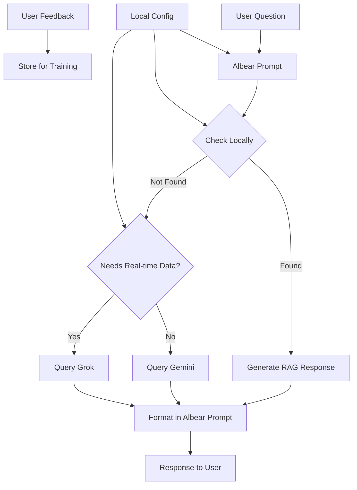

# run-ragged



## development packages
```shell
devbox shell
```
## secrets / config
```shell
doppler setup
```
## environment variables
```shell
export PROJECT_PREFIX='pt'
export PROJECT_NAME='demo-lc-rag'
export PROJECT_SUFFIX=$(date +%Y%m%d)
export PROJECT=${PROJECT_PREFIX}-${PROJECT_NAME}-${PROJECT_SUFFIX}
```
## cloud setup
```shell
gcloud auth print-access-token > /dev/null 2>&1 || gcloud auth login
gcloud projects describe ${PROJECT} > /dev/null 2>&1 || gcloud projects create ${PROJECT}
gcloud projects list --filter="name:${PROJECT} AND lifecycleState:ACTIVE" || gcloud config set project ${PROJECT}
gcloud auth application-default print-access-token > /dev/null 2>&1 || gcloud auth --quiet application-default login
gcloud auth application-default set-quota-project ${PROJECT} && doppler run --command="gcloud billing projects link ${PROJECT} --billing-account=\${GCLOUD_BILLING_FFI}"
gcloud projects list --filter="name:${PROJECT} AND lifecycleState:ACTIVE" && gcloud config set project ${PROJECT}
gcloud config get project | grep -q ${PROJECT} && yes | gcloud services enable cloudresourcemanager.googleapis.com && gcloud services enable \
  aiplatform.googleapis.com \
  artifactregistry.googleapis.com \
  bigqueryconnection.googleapis.com \
  bigquery.googleapis.com \
  cloudbuild.googleapis.com \
  documentai.googleapis.com \
  run.googleapis.com \
  secretmanager.googleapis.com \
  sqladmin.googleapis.com \
  storage.googleapis.com
```
## add database
```shell
doppler run --command="gcloud sql instances describe \${DB_INSTANCE_DEMO} > /dev/null 2>&1 || gcloud sql instances create \${DB_INSTANCE_DEMO} \
  --database-version \${DB_VERSION_DEMO} \
  --tier \${DB_TIER_DEMO} \
  --region \${GCLOUD_REGION}"
doppler run --command="gcloud sql databases describe \${DB_NAME_DEMO} --instance=\${DB_INSTANCE_DEMO} > /dev/null 2>&1 || gcloud sql databases create \${DB_NAME_DEMO} \
  --instance \${DB_INSTANCE_DEMO}"
doppler run --command="gcloud sql users describe \${DB_USERNAME_DEMO} --instance=\${DB_INSTANCE_DEMO} > /dev/null 2>&1 || gcloud sql users create \${DB_USERNAME_DEMO} \
  --instance \${DB_INSTANCE_DEMO} \
  --password \${DB_PASSWORD_DEMO}"
```
## add storage
```shell
doppler run --command="gcloud storage buckets get-iam-policy gs://\${PDF_BUCKET_DEMO}-\${PROJECT_SUFFIX} > /dev/null 2>&1 || gcloud storage buckets create gs://\${PDF_BUCKET_DEMO}-\${PROJECT_SUFFIX} --project=\${PROJECT} --location=\${GCLOUD_REGION}"
```
## build+run indexer
```shell
doppler run --command="gcloud run deploy indexer \
  --quiet \
  --memory 4G \
  --source run-ragged/. \
  --command python \
  --args /code/app/indexer.py \
  --set-env-vars=DB_INSTANCE_NAME=\$(gcloud sql instances describe \${DB_INSTANCE_DEMO} --format 'value(connectionName)') \
  --set-env-vars=DB_USER=\${DB_USERNAME_DEMO} \
  --set-env-vars=DB_NAME=\${DB_NAME_DEMO} \
  --set-env-vars=DB_PASS=\${DB_PASSWORD_DEMO} \
  --set-env-vars=PDF_BUCKET_NAME=\${PDF_BUCKET_DEMO}-${PROJECT_SUFFIX} \
  --set-env-vars=SERVICE_TYPE=indexer \
  --region=\${GCLOUD_REGION} \
  --allow-unauthenticated"
```
## build+run API
```shell
doppler run --command="gcloud run deploy run-ragged \
  --source run-ragged/. \
  --set-env-vars=DB_INSTANCE_NAME=\$(gcloud sql instances describe \${DB_INSTANCE_DEMO} --format 'value(connectionName)') \
  --set-env-vars=DB_USER=\${DB_USERNAME_DEMO} \
  --set-env-vars=DB_NAME=\${DB_NAME_DEMO} \
  --set-env-vars=DB_PASS=\${DB_PASSWORD_DEMO} \
  --set-env-vars=PDF_BUCKET_NAME=pdf-bucket-${PROJECT_SUFFIX} \
  --set-env-vars=SERVICE_TYPE=server \
  --set-env-vars=INDEXER_SERVICE_URL=\$(gcloud run services describe indexer --region \${GCLOUD_REGION} --format 'value(status.url)' --project ${PROJECT}) \
  --set-env-vars=GROK_API_KEY=\$GROK_API_KEY \
  --region=\$GCLOUD_REGION \
  --allow-unauthenticated"
```
